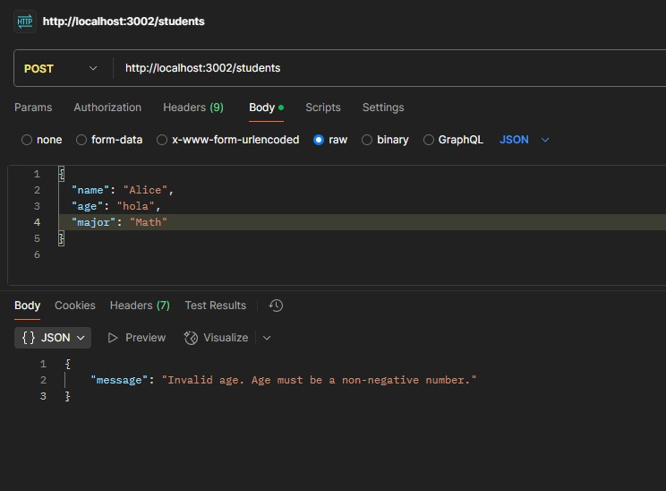
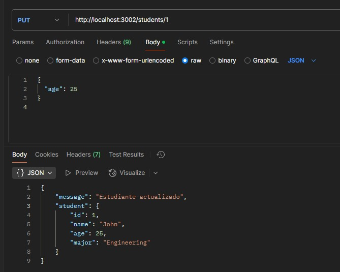
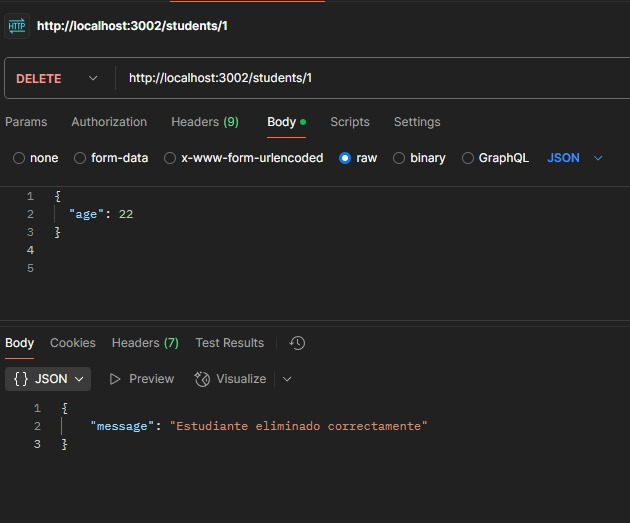

# API de Estudiantes

Esta API permite gestionar un listado de estudiantes, ofreciendo operaciones para obtener, crear, actualizar y eliminar estudiantes. También incluye autenticación mediante un token y validaciones de datos.

## **Ejecución del servidor**

1. Asegúrate de que el archivo `students.json` se encuentre en la raíz del proyecto.
2. Ejecuta el siguiente comando para iniciar el servidor:
   ```bash
   node server.js
   ```
3. El servidor estará disponible en `http://localhost:3002`.

## **Endpoints**

### **1. Obtener todos los estudiantes**
- **Método:** `GET`
- **Ruta:** `/students`
- **Descripción:** Devuelve un listado en formato JSON con todos los estudiantes registrados.

### **2. Obtener un estudiante por ID**
- **Método:** `GET`
- **Ruta:** `/students/:id`
- **Descripción:** Retorna los detalles de un estudiante específico. Si el ID no existe, devuelve un mensaje de error.

### **3. Crear un estudiante**
- **Método:** `POST`
- **Ruta:** `/students`
- **Requiere autenticación:** Sí (Token en el encabezado `Authorization`)
- **Descripción:** Agrega un nuevo estudiante con `name`, `age` y `major`. El `id` se genera automáticamente.
- **Errores posibles:** Falta de autenticación o datos inválidos (ej. nombre vacío, edad negativa).

### **4. Actualizar un estudiante**
- **Método:** `PUT`
- **Ruta:** `/students/:id`
- **Requiere autenticación:** Sí
- **Descripción:** Permite modificar los datos de un estudiante excepto el `id`. Si el `id` no existe, devuelve un mensaje de error.
- **Errores posibles:** Token inválido o datos incorrectos.

### **5. Eliminar un estudiante**
- **Método:** `DELETE`
- **Ruta:** `/students/:id`
- **Requiere autenticación:** Sí
- **Descripción:** Elimina un estudiante del listado por su `id`. Si el `id` no existe, devuelve un error.

## **Autenticación**
- La API requiere autenticación para las operaciones `POST`, `PUT` y `DELETE`.
- Se debe enviar un token en el encabezado de la solicitud:
  ```Authorization: Bearer mysecrettoken```
- Si el token es incorrecto o no se envía, se devuelve un error `403 Forbidden`.

## **Validaciones**
- `name`: Debe ser una cadena de texto no vacía.
- `age`: Debe ser un número mayor o igual a 0.
- `major`: Debe ser una cadena de texto no vacía.
- Si algún dato no cumple con los requisitos, se devuelve un error `400 Bad Request`.

## **Evidencias de pruebas en Postman**
A continuación, se presentan capturas de pantalla de las pruebas realizadas en Postman para verificar el correcto funcionamiento de la API.

### **1. Incumplimiento de validación (POST)**


### **2. Actualización de estudiante (PUT)**


### **3. Eliminación de estudiante (DELETE)**


### **4. Token incorrecto o ausente (Error 403)**


